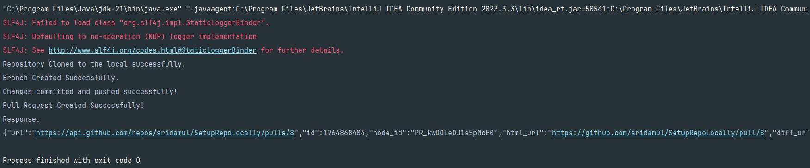
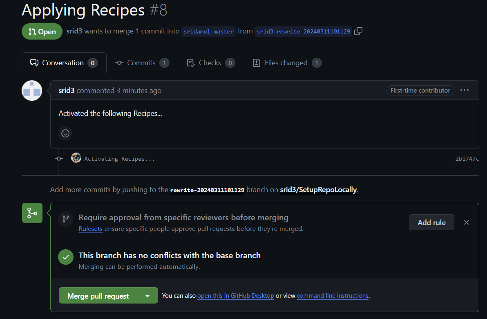

This Repo is used to create a new branch in the Cloned repo, commit the changes after OpenRewrite
Transformations (here we created a sample file to test the changes), push the changes to remote repo
followed by triggering the creation of PR in the Original Repo. In our case it is 
https://github.com/jenkinsci/plugin_name

For testing purposes, I have forked my own repo. So, I have hardcoded the link in the
file. This will be later replaced with dynamic links.

This requires to set the Environmental Variable TOKEN=your_token

### Sample result

### Here is the created PR!

The branch name is created based on time, to get rid of naming issues.

